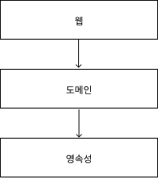

## 학습 목표
- 계층형 아키텍처의 잠재적인 단점 파악
- 아키텍처 경계를 강제하는 방법들
- 잠재적인 지름길들이 소프트웨어 아키텍처에 끼치는 영향
- 언제 어떤 스타일의 아키텍처를 사용할지 결정
- 아키텍처에 따른 코드 구성
- 아키텍처의 각 요소를 포함하는 테스트 적용

## 계층형 아키텍처의 문제는 무엇일까?

일반적인 3계층 아키텍처는 웹 계층에서 요청을 받아 도메인 혹은 비즈니스 계층에 있는 서비스로 요청을 보냅니다.
서비스에서는 비즈니스 로직을 수행하고, 도메인 엔티티의 상태 조회나 변경을 위해 영속성 계층의 컴포넌트를 호출합니다.

이런 계층형 아키텍처의 문제점은 코드에 나쁜 습관이 스며들기 쉽고 시간이 지날수록 변경하기 어려워지는 허점이 있습니다.

### 계층형 아키텍처는 데이터베이스 주도 설계를 유도한다.
전통적인 계층형 아키텍처의 토대는 데이터베이스입니다.
그림 1.1처럼 영속성 계층을 가장 기본으로 의존하기 떄문에 모든 것은 영속성 기준으로 만들어집니다.

우리가 만드는 애플리케이션의 목적은 규칙이나 정책을 반영한 모델을 만들어 규칙과 정책을 편리하게 활용하게 만듭니다.
이때 우리는 상태가 아니라 행동을 중심으로 모델링하게 됩니다. 행동을 통해 상태를 바꿔나갑니다.

계층형 아키텍처로 구성할 때를 생각해보면 도메인 로직보다 데이터베이스 구조를 먼저 생각하게 됩니다.
이는 합리적인 것이 의존성의 방향에 따라 자연스럽게 구현한 것이기 때문입니다.
하지만 비즈니스적 관점에서는 다른 무엇보다도 도메인 로직을 먼저 만들어야 합니다.
그래야 우리가 로직을 제대로 이해했는지 확인할 수 있고 그를 기반으로 영속성과 웹 계층을 만들어야 합니다.

데이터베이스 중심적인 아키텍처가 만들어지는 가장 큰 원인은 ORM 프레임워크를 사용하기 때문입니다.
ORM 프레임워크를 사용하면서 비즈니스 규칙과 영속성 관점을 섞고 싶은 유혹을 쉽게 받게 됩니다.

## 의존성 역전하기
